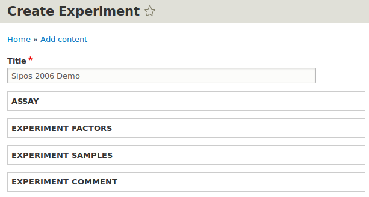
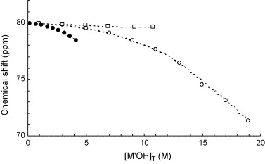
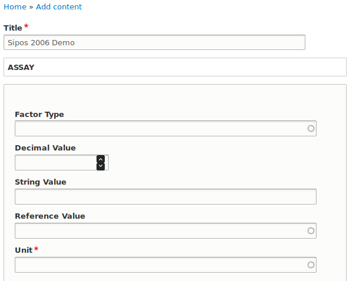

#####################
Data Upload Tutorials
#####################

*Tutorials for interacting with the IDREAM Drupal website.*

**************
Uploading Data
**************

Simple Literature Upload
========================

A single figure (3) from a 2006 paper by Sipos will be used an example for
extracting literature data. This example is not meant to show a
complete upload -- rather it is meant be as simple as possible while
still remaining useful.

DOI: https://doi.org/10.1016/j.talanta.2006.02.008

Experiment Creation
-------------------

First navigate to: **Home >> Add Content** and select **Experiment** to
upload a new set of data. Enter a any desired title.

Data Extraction
^^^^^^^^^^^^^^^

Consider the following figure taken from the paper above:

    Fig. 3. 27Al NMR chemical shift vs. the total molar concentration of
    KOH (□), NaOH (○) and LiOH (●) at [Al(III)]T = 0.005 M.

By using an online extraction tool, we can estimate the values of these points.
In this case, WebPlotDigitizer was used.

In considering how best to organize data, it is always best to group like
by like. In this case an **Assay** will be created for each species.

Accordingly the data for the KOH assay will be as follows::

    OH_concentration,Al_ppm
    0.89,79.96
    2.93,79.90
    4.92,79.84
    6.85,79.72
    9.13,79.66
    10.71,79.66

Two more sets of data can be extracted in this way, and are the core
set of data we are interested in. So they must each have factors
describing them. The column names can stay or go, they are
not interpreted by ``ChemMD``.

Experiment Factor Creation
^^^^^^^^^^^^^^^^^^^^^^^^^^

Since the .csv files were all made in the same way -- with the
hydroxide or base concentration in the first column and the aluminum
ppm shifts in the second, we can create a top-level factor for the
aluminum ppm shifts. This is not done for the hydroxide values as
each **assay** must model different samples or species.

Select **Experiment Factors** to and select **Add New Factor**
to add a new top-level factor. Experiment factors apply to
every sample contained by each assay in this experiment.

Supply the following data:

Al 27 ppm Factor
""""""""""""""""

+------------------+-------------------------+
| Factor Type      |  Measurement            |
+------------------+-------------------------+
| Unit Reference   |  ppm                    |
+------------------+-------------------------+
| CSV Column Index |  2                      |
+------------------+-------------------------+
| Decimal Value    |  Leave blank            |
+------------------+-------------------------+
| String Value     |  Leave blank            |
+------------------+-------------------------+
| Reference Value  |  Leave blank            |
+------------------+-------------------------+

The **Factor Type** is *Measurement* as this is a value of interest
that is not set or known prior to running the experiment.

The **Unit Reference** is chosen to be ppm. (A factor describing the
compound ppm is referenced to can also be added, but is not strictly
necessary.)

The **CSV column index** is the 1-originated index of the column
containing the ppm values.

The other fields are left blank, occasionally you may find cause to
enter a value in the **Reference Value** with .csv data, however
if a csv index is set, the decimal and string values will be ignored.

Assay Creation
--------------

Now it is time to create the entity that will hold one of the three
.csv data files we created earlier. Select **Assay >> Add new Assay**
to create a new assay entry.

.. figure:: _static/simple_list_03.png
    Adding a new **Assay**.

CSV Upload
^^^^^^^^^^

The most critical step here is to **select experiment data**. In this
case, the .csv file shown above.

Assay Sample Creation
^^^^^^^^^^^^^^^^^^^^^

Now we must ensure that there is a sample associated with this data.
That is, what material(s) does this data describe and what are their
stoichiometric ratio's to each other?

To model the potassium hydroxide species a sample will be created which
holds the species references and any factors associated with them.

Concentration Factor Creation
"""""""""""""""""""""""""""""

Select **Add new Factor** and enter the following, and then select
**Create Factor**.

+------------------+-------------------------+
| Factor Type      |  Measurement Condition  |
+------------------+-------------------------+
| Unit Reference   |  Molar                  |
+------------------+-------------------------+
| CSV Column Index |  1                      |
+------------------+-------------------------+
| Decimal Value    |  Leave blank            |
+------------------+-------------------------+
| String Value     |  Leave blank            |
+------------------+-------------------------+
| Reference Value  |  Leave blank            |
+------------------+-------------------------+

Species Creation
""""""""""""""""

Now to associate the factor created above with any species desired.

In this case, simply hydroxide and a potassium cation. The supporting
information stipulates these have been added in a 1:1 ration.

+-------------------+---------+-------+
| Species Reference | K+      | OH-   |
+-------------------+---------+-------+
| Stoichiometry     | 1.0     | 1.0   |
+-------------------+---------+-------+

Create a species for each of these entries.

**Create another Sample**

The aluminum should be modeled as well.

+-------------------+---------+
| Species Reference | Al(III) |
+-------------------+---------+
| Stoichiometry     | 1.0     |
+-------------------+---------+

Experiment Comment Creation
---------------------------

For now we can dump any other text-based information in an
assay or experiment comment. This is an easy way to maintain
information without going through most of this process,
these entries can always be updated later.

Select **Add new Comment** and copy-paste any relevant
supporting information into the text field.

Simple Simulation Upload
========================

Ernesto Example.

Simple Experimental Upload
==========================

Mat Example

Complex Experimental Upload
===========================

Trent Example
